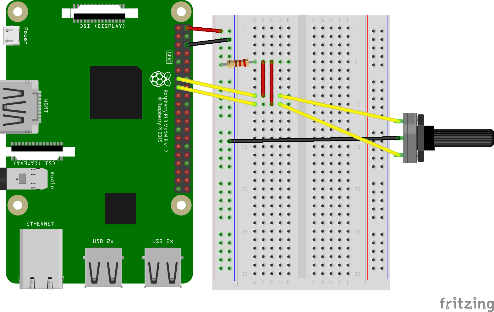

## Requirements:
- Raspberry Pi 3b+
- SD Card (min 16GB)
- USB power supply
- HDMI monitor (only for setup)
- USB keyboard (only for setup)
- Rotary encoder
- Knob for the encoder
- Jumper wires
- Resistor 1kΩ
- Breadboard
- Speaker

## Steps
### 1. Install system
Download [Raspbian Stretch Lite](https://www.raspberrypi.org/downloads/raspbian/). You can use Raspbian Stretch with desktop if you are more comfortable with a GUI. Flash the image to the sd card (You can use [Etcher](https://www.balena.io/etcher/)).

### 2. Setup system
Connect the monitor and the keyboard. Connect the pi with an ethernet cable to your network.  
_Insert the flashed sd card into the pi before connecting it to the power supply._

#### Extend the filesystem
```BASH
sudo raspi-config
```
Select option `7 Advanced Options`, and select `Expand Filesystem`
Select option `5 Interfacing Options`, and select `P2 SSH`

#### Update the system
Run the following commands:
```BASH
sudo apt update
sudo apt dist-upgrade
sudo reboot
```

#### Setup connection
Connect to the pi using a SSH connection. Open a terminal and type `ssh -Y pi@raspberrypi.local`

### 3. Install software
#### Install NodeJS
This software runs on NodeJS. To install, run the following commands:
```BASH
curl -sL https://deb.nodesource.com/setup_10.x | sudo -E bash -
sudo apt-get install -y nodejs
```

#### Install Fluidsynth
This code uses fluidsynth for it's midi playback.
```BASH
sudo apt-get install fluidsynth
```

#### Download the code
```BASH
wget https://github.com/JochemVanIterson/MidiInTheBox/archive/master.zip
unzip master.zip
cd MidiInTheBox-master
sudo cp midiinthebox.service /etc/systemd/system/
sudo systemctl enable midiinthebox.service
chmod +x nodejs/index.js
cd nodejs
npm install
```

### 4. Hardware
Shut down your Raspberry Pi.  
Solder three jumper wires to each rotary encoder pin.  
**_WARNING:_** _Do not turn on the Pi without inserting the resistor. If you don't there will be a continuous 5v connection and you will blow up your Pi._  
Connect the circuit:  

For more information about the rotary encoder: [ALPS STEC12E07 Encoder | Datasheet](http://www.produktinfo.conrad.com/datenblaetter/700000-724999/700701-da-01-en-ENCODER_STEC12E07.pdf)

### 5. Run the code
(Re)start your Raspberry Pi. The program should run automatically. If it doesn't you may have to start it yourself.
```BASH
sudo systemctl start midiinthebox.service
```
To see the status of the program run:
```BASH
sudo systemctl status midiinthebox.service
```

### 6. The config file
Inside the nodejs folder is a file named config.json. In this file you can change parameters like the smallest playable note (default is a 64th note). You can also add more midi files.  
Before you add the midi file you'll first have to make sure the  file is compatible with the system.  [MuseScore](https://musescore.com) is a free, opensource music notation program in which you can edit the notes and instruments of the midi file.  
Once you'r sure the midi file is compatible you can upload it to the pi. Because the sdcard is now formatted as a linux system you will not be able to insert it into your computer again. We will use sftp to put the file on the pi.

Open a terminal and go to the folder where your midi file is stored. Then use sftp to connect with the pi and upload the file.
```BASH
cd <folder of the midifile>
sftp pi@raspberrypi.local
cd MidiInTheBox/nodejs/midiFiles/
put <midifile.mid>
exit
```
Change the config file to use the uploaded midifile(s). Go to the nodejs folder and type `nano config.json`. Now append the name of your midifile to the "midiFiles" block.  
Change the playCursor to select the file you want to play (starting from 0). To repeat a midifile instead of playing them one by one, change loop to `true`

### 7. Turning off the pi
```BASH
sudo shutdown -h now
```
Wait for the green led to stop blinking and remain off. Now remove the power cable.
